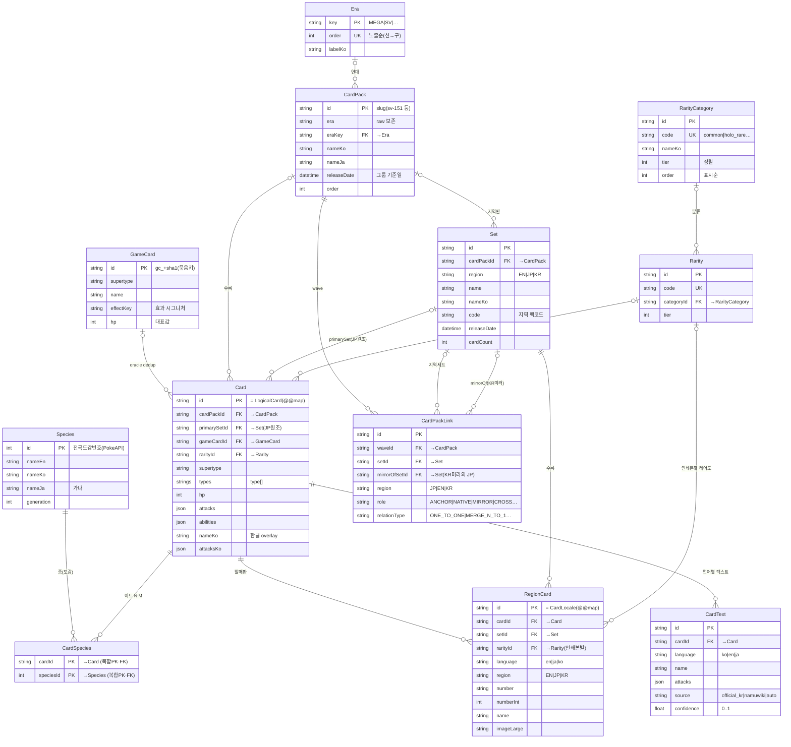
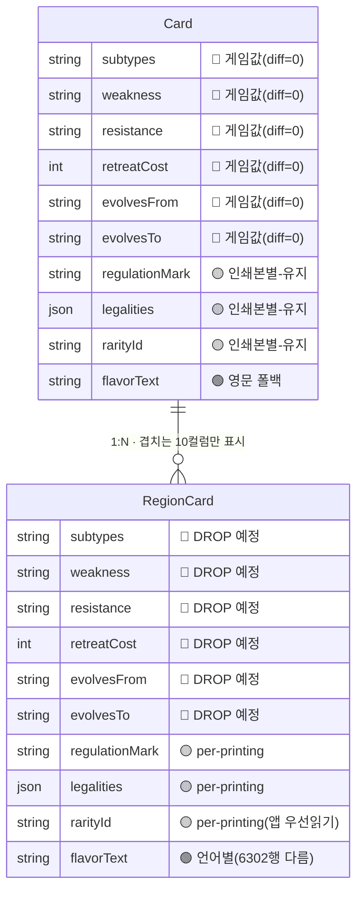
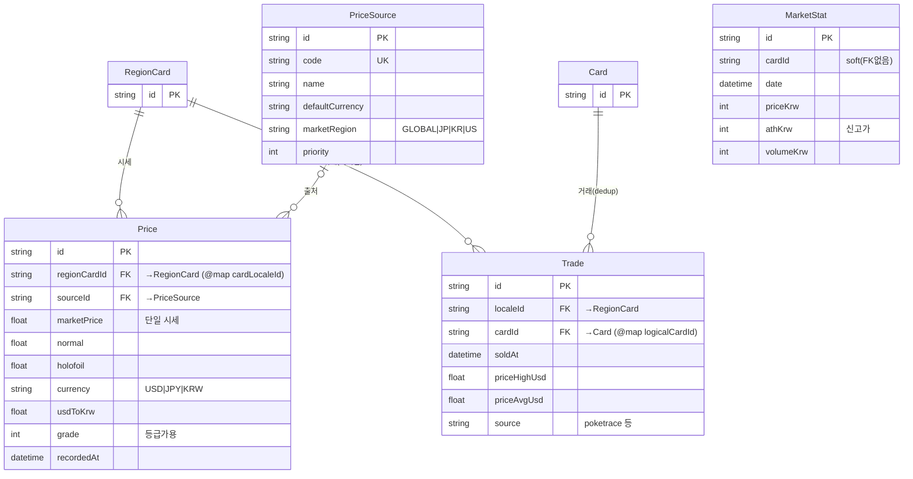
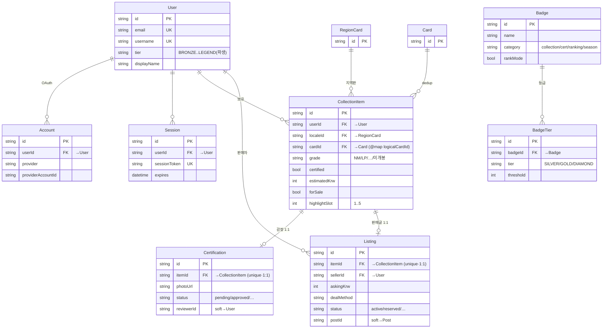
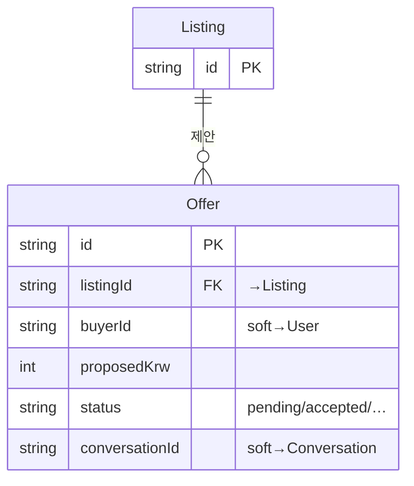
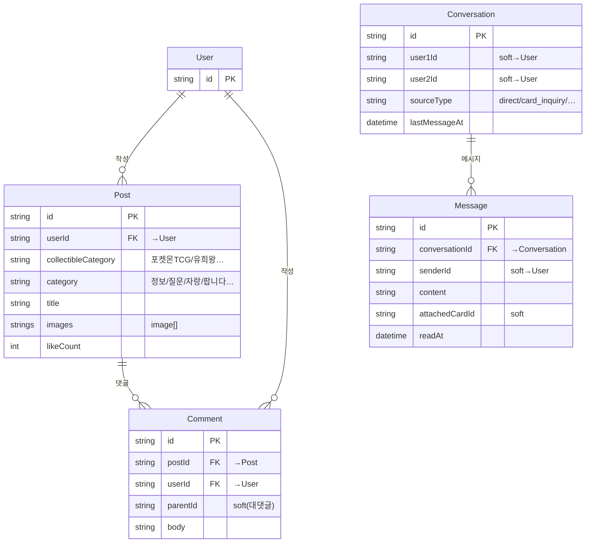
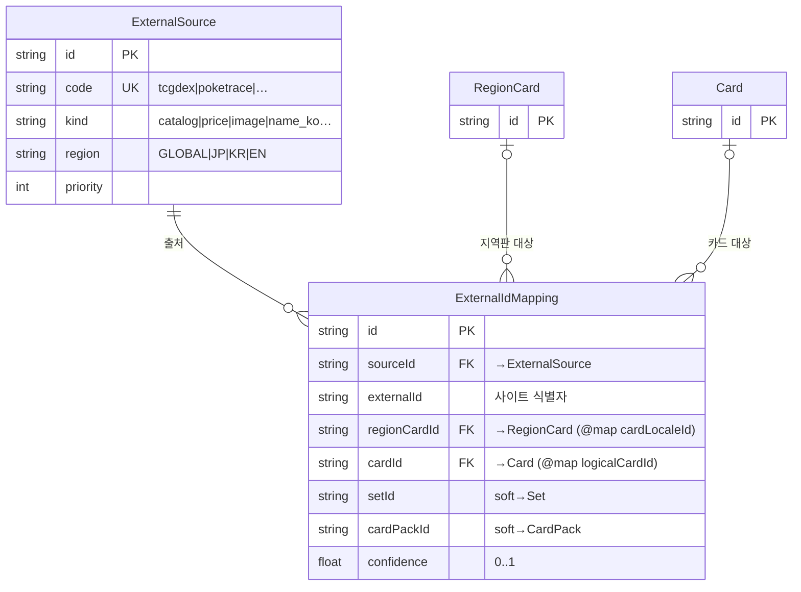

# raredoc ERD (Entity-Relationship Diagram)

> 출처: `prisma/schema.prisma` (모델 60개 · FK 관계 50개 · 무FK 소프트참조는 §8).
> 아래 다이어그램은 **Mermaid** 문법이라 GitHub `.md`, Notion(`/code` → mermaid), Obsidian, Docusaurus,
> [mermaid.live](https://mermaid.live) 에 **그대로 붙여 넣으면 렌더**됩니다. 별도 툴 불필요.
> 더 예쁜 인터랙티브 뷰를 원하면 같은 폴더의 [`erd.dbml`](./erd.dbml) 을 [dbdiagram.io](https://dbdiagram.io) 에 붙여 넣으세요.

표기 규칙(Mermaid 까마귀발/crow's foot):

| 기호 | 의미 |
|---|---|
| `||--o{` | 1 : N (부모 필수) — 자식의 FK가 **NOT NULL** |
| `|o--o{` | 0/1 : N (부모 선택) — 자식의 FK가 **nullable** |
| `||--o|` | 1 : 0/1 (유니크 FK = 1:1) |
| 본문 `… (FK없음)` | DB FK 미설정. 앱 레벨에서만 연결 — §8 참고 |

---

## 1. 한눈에 보기 — 도메인 지도

모든 게 **카드 정체성 코어**(`Card` 아트정체성 / `RegionCard` 지역발매판)에 매달립니다.
나머지 도메인은 거의 전부 이 두 허브를 참조합니다.

```mermaid
flowchart LR
  subgraph CORE["🎴 카드 정체성 코어"]
    direction TB
    Species --> CardSpecies --> Card
    GameCard --> Card
    Era --> CardPack
    CardPack --> Card
    CardPack --> Set
    Card --> RegionCard
    Set --> RegionCard
    Card --> CardText
    RarityCategory --> Rarity
    Rarity --> Card
    CardPackLink
  end

  subgraph MARKET["💰 마켓·시세"]
    Price
    Trade
    PriceSource
    MarketStat
  end

  subgraph USERDOM["👤 유저·컬렉션·게이미피케이션"]
    User
    CollectionItem
    Certification
    Badge
    Listing
  end

  subgraph COMM["💬 커뮤니티·메시징"]
    Post --> Comment
    Conversation --> Message
  end

  subgraph META["🏆 메타·대회"]
    DeckArchetype
    DeckCard
    Tournament --> TournamentStanding
  end

  subgraph EXT["🔌 외부 출처 매핑"]
    ExternalSource --> ExternalIdMapping
  end

  RegionCard -. "시세" .-> Price
  RegionCard -. "거래" .-> Trade
  PriceSource -. .-> Price
  RegionCard -. "보유" .-> CollectionItem
  Card -. "보유 dedup" .-> CollectionItem
  User -. .-> CollectionItem
  CollectionItem -. "1:1" .-> Listing
  CollectionItem -. "1:1" .-> Certification
  User -. .-> Post
  Card -. "덱 4장" .-> DeckCard
  DeckCard -. .-> DeckArchetype
  RegionCard -. .-> ExternalIdMapping
  Card -. .-> ExternalIdMapping

  classDef core fill:#FFF4E5,stroke:#E8820C,color:#7A4100;
  classDef market fill:#E8F7EE,stroke:#1AAB55,color:#0B5C2E;
  classDef user fill:#EAF2FF,stroke:#3B82F6,color:#1E3A8A;
  classDef comm fill:#F3EAFB,stroke:#9333EA,color:#4C1D95;
  classDef meta fill:#FFEAEA,stroke:#E11D48,color:#831843;
  classDef ext fill:#EEF2F4,stroke:#64748B,color:#334155;
  class Species,CardSpecies,Card,GameCard,Era,CardPack,Set,RegionCard,CardText,RarityCategory,Rarity,CardPackLink core;
  class Price,Trade,PriceSource,MarketStat market;
  class User,CollectionItem,Certification,Badge,Listing user;
  class Post,Comment,Conversation,Message comm;
  class DeckArchetype,DeckCard,Tournament,TournamentStanding meta;
  class ExternalSource,ExternalIdMapping ext;
```

---

## 2. 카드 정체성 코어 (★ 핵심)

4계층 정체성: **Species**(종) → **GameCard**(게임상 같은 카드=oracle) → **Card**(아트 정체성) → **RegionCard**(지역 발매판).
팩 축은 **Era**(연대) → **CardPack**(논리 확장팩) → **Set**(지역판). `CardPackLink` 가 팩↔지역세트 대응표.

> ⚠️ 아래 엔티티의 속성은 **대표 컬럼만 발췌**했습니다(가독성). 전체 컬럼은 `prisma/schema.prisma` 참고.
> 특히 `Card`↔`RegionCard` 는 **같은 이름 컬럼 10개가 겹치는데** 분량상 이 도식엔 `rarityId` 만 보입니다 —
> 그 중복의 정체·실측 판정은 바로 아래 **§2-1** 에서 따로 다룹니다.



### 2-1. ⚠️ Card ↔ RegionCard 중복 (마이그레이션 과도기)

두 테이블엔 **같은 이름 컬럼이 10개** 겹칩니다(위 코어 도식에선 `rarityId` 만 보였음). 아래는 그 10개만 추려
DB **60,643행 실측**으로 분류한 것 — 🔴순수중복 / 🟡유지 / 🟢중복아님.



| 겹치는 컬럼 | RegionCard가 Card와 **다른 행수** | 판정 |
|---|---|---|
| `subtypes` `weakness` `resistance` `retreatCost` `evolvesFrom` `evolvesTo` | **0 / 60,643** | 🔴 순수 중복 → DB 컬럼 **DROP 예정**(배포 게이트). 앱은 이미 `Card` 직독 |
| `regulationMark` `legalities` `rarityId` | **0** (현재는 동일) | 🟡 인쇄본별로 달라질 수 있어 **의도적 유지**. 앱은 RegionCard 우선·Card 폴백 |
| `flavorText` | **6,302 다름 + 6,088 RegionCard 단독** | 🟢 언어별 실데이터 → 중복 아님(Phase 7서 `CardText` 로 일원화 예정) |

- **`Card` 전용**(겹침 없음): `hp` `types` `attacks` `abilities` `illustrator` `supertype` `rules` — 게임 능력치는 언어 중립이라 여기만.
- **`RegionCard` 전용**: `name` `number`/`numberInt` `imageSmall`/`imageLarge` `region` `language` `setId` — 인쇄본마다 다른 표시값(중복 아님).

---

## 3. 마켓·시세

`RegionCard`(실제 발매판) 단위로 시세/거래를 기록. `Trade` 는 시장분석 dedup 위해 `Card` 도 함께 참조.



> `MarketStat` 은 FK 없이 `cardId` 만 보유(랭킹 캐시) — §8.

---

## 4. 유저·컬렉션·게이미피케이션



> 무FK(소프트): `UserBadge`, `Season`, `RankingSnapshot`, `Appointment`, `Review`, `Offer.buyerId` — §8.

### 4-1. 마켓플레이스 거래 흐름



---

## 5. 커뮤니티·메시징



> 무FK(소프트): `PostLike`, `CommentLike`, `ConversationRead`, `Conversation.user1Id/user2Id`, `Message.senderId` — §8.

---

## 6. 메타·대회 (cardgame)

```mermaid
erDiagram
  DeckArchetype ||--o{ DeckCard : "카드 구성"
  DeckArchetype ||--o{ DeckRecipeCard : "표준 레시피"
  DeckArchetype ||--o{ DeckVariant : "변형"
  DeckArchetype ||--o{ ArchetypeTrend : "주간 추이"
  DeckArchetype ||--o{ ArchetypeRegionStat : "지역 집계"
  DeckArchetype ||--o{ DeckMatchup : "상성 A"
  DeckArchetype ||--o{ DeckMatchup : "상성 B"
  Card ||--o{ DeckCard : "덱 4장(게임 dedup)"
  Tournament ||--o{ TournamentStanding : "입상"
  Tournament ||--o{ TournamentSourceRef : "출처 연결"

  DeckArchetype {
    string id PK "= Limitless deck.id"
    string nameKo
    string tier "S/A/B/C(파생)"
    string regulation "스탠다드/익스텐디드"
    float usageRate
    float winRate
    int deckCostBudget "견적 캐시(KRW)"
    int deckCostPremium
  }
  DeckCard {
    string id PK
    string archetypeId FK "→DeckArchetype"
    string cardId FK "→Card (@map logicalCardId)"
    int count
    string role "✓/⚠/✗"
  }
  DeckRecipeCard {
    string id PK
    string archetypeId FK "→DeckArchetype"
    string cardName "Limitless 영문"
    string setCode
    float avgCount
    float adoptionRate
    string cardId "soft→Card(FK없음)"
  }
  DeckMatchup {
    string id PK
    string deckAId FK "→DeckArchetype"
    string deckBId FK "→DeckArchetype"
    int winsA
    int winsB
    float winRateA
  }
  DeckVariant {
    string id PK
    string archetypeId FK "→DeckArchetype"
    string nameKo
  }
  ArchetypeTrend {
    string id PK
    string archetypeId FK "→DeckArchetype"
    string region "INTL|JP|KR"
    string week "2026-W22"
    float usage
  }
  ArchetypeRegionStat {
    string id PK
    string archetypeId FK "→DeckArchetype"
    string region "INTL|JP|KR"
    string tier
    float usageRate
    int sampleSize
  }
  Tournament {
    string id PK "{소스}-{sourceId}"
    string source "limitless/jp-official/…"
    string metaRegion "INTL|JP|KR"
    string level "worlds/ic/regional/city…"
    string nameKo
    datetime date
    int players
    string winnerArchetypeId "soft→DeckArchetype"
  }
  TournamentStanding {
    string id PK
    string tournamentId FK "→Tournament"
    int placing
    string playerName
    string deckKey "soft→DeckArchetype.id"
    json decklist
    string deckCode "복사/재수집 키"
  }
  TournamentSourceRef {
    string id PK
    string tournamentId FK "→Tournament"
    string source "kr-official/pokedata/…"
    string role "primary|enrichment"
  }
  Card {
    string id PK
  }
```



> `DeckRecipeCard.cardId`, `TournamentStanding.deckKey`, `Tournament.winnerArchetypeId`, `PlayerRanking.favArchetypeId` 는 의도적 무FK(집계 시점 미존재) — §8.

---

## 7. 외부 출처 매핑 (다출처 정합)

한 매핑 행은 `regionCard / card / set / cardPack` 중 **정확히 하나**만 가리킵니다(앱 레벨 검증).
`set`·`cardPack` 방향은 FK 미설정(소프트).



---

## 8. 무FK 소프트 참조 (DB 외래키 미설정 · 앱 레벨만 연결)

스키마상 FK는 없지만 의미상 연결되는 컬럼들. 집계 시점에 대상이 아직 없거나(대회), 캐시/로그성이라
참조무결성을 일부러 풀어 둔 것입니다. 마이그레이션/삭제 시 cascade 가 **걸리지 않으니** 주의.

| 출발 모델.컬럼 | 의미상 대상 | 왜 무FK인가 |
|---|---|---|
| `MarketStat.cardId` | (카드) | 랭킹 캐시 — 의미 모호·성능 |
| `PullRate.setId` | `Set` | 봉입률 시드 |
| `UserBadge.userId / badgeId` | `User` / `Badge` | 게이미피케이션 캐시(`@@unique`만) |
| `RankingSnapshot.userId` | `User` | 일별 스냅샷 로그 |
| `PostLike.postId / userId` | `Post` / `User` | 좋아요(`@@unique`만) |
| `CommentLike.commentId / userId` | `Comment` / `User` | 좋아요(`@@unique`만) |
| `Conversation.user1Id / user2Id` | `User` | DM 참가자 |
| `ConversationRead.conversationId / userId` | `Conversation` / `User` | 읽음 표식 |
| `Message.senderId / attachedCardId / appointmentId / reviewId` | `User` 등 | 메시지 부가참조 |
| `Offer.buyerId / conversationId` | `User` / `Conversation` | 제안 |
| `Appointment.offerId` | `Offer` | 약속 |
| `Review.raterId / rateeId / offerId` | `User` / `Offer` | 거래후기 |
| `Listing.postId` | `Post` | 커뮤니티 거래글 연동(선택) |
| `Certification.reviewerId` | `User` | 감정 리뷰어 |
| `DeckRecipeCard.cardId` | `Card` | 레시피-카드 매칭(미상 허용) |
| `TournamentStanding.deckKey` | `DeckArchetype.id` | 동기화 시점 아키타입 미존재 → 사후 조인 |
| `Tournament.winnerArchetypeId` | `DeckArchetype` | 1위 standing deckKey |
| `PlayerRanking.favArchetypeId` | `DeckArchetype` | 선호 덱 |
| `ExternalIdMapping.setId / cardPackId` | `Set` / `CardPack` | 매핑 4대상 중 택1 |

독립 테이블(관계 없음): `VerificationToken`, `GlossaryEntry`, `Ruling`(Card에 nullable FK는 있음), `Season`.

---

## 9. 물리명 ≠ Prisma 명 (@map 주의)

리네임 마이그레이션(2026-06) 으로 **Prisma 모델/필드명**과 **DB 물리명**이 갈립니다. raw SQL 작성 시 물리명 사용.

| Prisma 모델 | DB 테이블(`@@map`) |
|---|---|
| `Card` | `LogicalCard` |
| `RegionCard` | `CardLocale` |
| `CardPack` | `SetGroup` |
| `CardSpecies` | `LogicalCardSpecies` |

| Prisma 필드 | DB 컬럼(`@map`) |
|---|---|
| `cardId` | `logicalCardId` |
| `regionCardId` | `cardLocaleId` |
| `cardPackId` | `setGroupId` |

> raw SQL 에서는 **항상 물리 컬럼명**(`logicalCardId`, `cardLocaleId`, `setGroupId`)을 써야 합니다.
